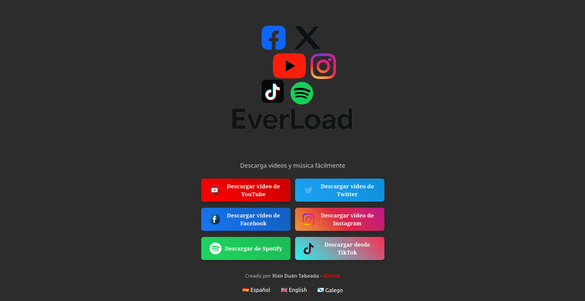
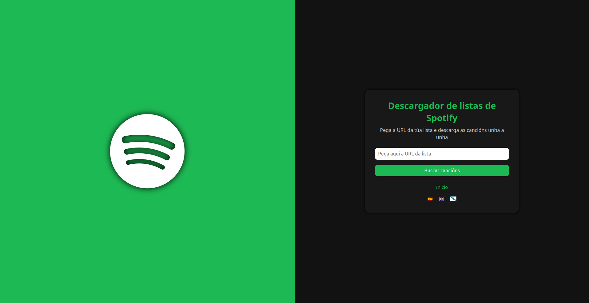
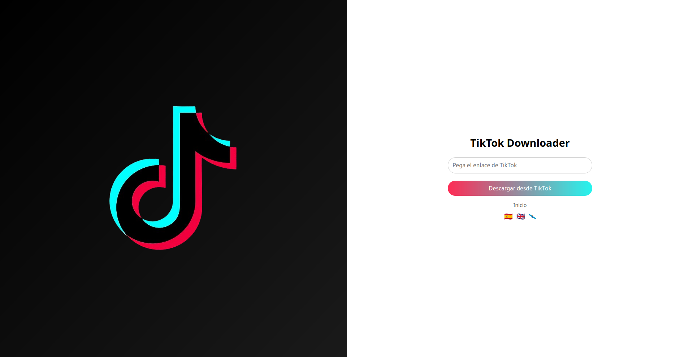

# EverLoad - Descarga Música y Videos de Internet

**EverLoad** es una aplicación desarrollada en **Spring Boot** y **Angular 15** que permite descargar fácilmente videos y audios desde las plataformas más populares, todo de forma rápida, segura y desde tu red privada.

**EverLoad** is an app built with **Spring Boot** and **Angular 15** that allows you to easily download videos and audio from the most popular platforms, quickly, securely, and within your private network.

**EverLoad** é unha aplicación feita con **Spring Boot** e **Angular 15** que permite descargar vídeos e audios das plataformas máis populares de forma rápida, segura e desde a túa rede privada.

---

## 🖼️ Vista previa de la aplicación

<p align="center">
  
</p>

<p align="center">
  
  
  
  
  
  
</p>

---

## 🚀 Características / Features / Características

- 📺 **YouTube**: descarga/download/descarga de vídeos e audios (MP3).
- 🐦 **Twitter/X**: vídeos públicos / public videos / vídeos públicos.
- 📘 **Facebook**: vídeos públicos / public videos / vídeos públicos.
- 📸 **Instagram**: Reels e posts públicos / public Reels and posts / Reels e publicacións públicas.
- 🎧 **Spotify**: Pega una playlist y descarga las canciones desde YouTube automáticamente. / Pega unha playlist e descarga as cancións de YouTube automaticamente
- 🎵 **TikTok**: Descarga vídeos pegando la URL directamente / Download videos by pasting the URL directly / Descarga vídeos pegando directamente la URL.
- 🌐 **Frontend multilingüe**: ES, EN, GL.
- 📦 **Backend con API REST** (Spring Boot) / Backend with REST API (Spring Boot) / Backend con API REST (Spring Boot).
- 🖼️ **UI responsive** y temática por plataforma. / Responsive UI with platform-specific themes / UI responsive e temática por plataforma.
- 🐳 **Preparado para Docker**. / Ready for Docker / Preparado para Docker.
- 📜 **Documentación Swagger** / Integrada.ntegrated Swagger documentation / Documentación Swagger integrada.

---

## 🛠️ Requisitos / Requirements / Requisitos

- Java 17+
- Node.js + Angular CLI
- [`yt-dlp`](https://github.com/yt-dlp/yt-dlp)

---

## ▶️ Ejecución Backend / Run Backend / Execución do Backend

```bash
mvn clean package
java -jar target/everload-1.0.0.jar
```

- `http://localhost:8080`

---

## 🌐 Ejecución Frontend / Run Frontend / Execución do Frontend

```bash
cd everload-front
npm install
ng serve
```

- `http://localhost:4200`

---

## 🔗 API Endpoints

### 📥 YouTube

- Video:  
  `GET /api/downloadVideo?videoId=VIDEO_ID&resolution=1080`

- Música / Music:  
  `GET /api/downloadMusic?videoId=VIDEO_ID&format=mp3`

### 🐦 Twitter/X

`GET /api/downloadTwitter?url=URL_TWEET`

### 📘 Facebook

`GET /api/downloadFacebook?url=URL_VIDEO`

### 📸 Instagram

`GET /api/downloadInstagram?url=URL_REEL`

### 🎵 TikTok

`GET /api/downloadTikTok?url=URL_VIDEO`

### 🎧 Spotify

`POST /api/spotify/playlist`

---

## 📜 Swagger

`http://localhost:8080/swagger-ui.html`

---

## 👤 Autor

**Xián Duán Taboada**  
🔗 [GitHub](https://github.com/xianDT01)

---

## ⚠️ Limitaciones / Limitations / Limitacións

- Instagram, Facebook y Twitter/X: Solo contenido público.
- Spotify: No descarga directamente desde Spotify. Se leen los títulos y se buscan en YouTube.

---

## 📝 Licencia

Este proyecto está bajo la Licencia MIT.  
Puedes usarlo, modificarlo y distribuirlo libremente, siempre que menciones al autor original:  
**Xián Duán Taboada – xiandt01@gmail.com**

Consulta el archivo [LICENSE](./LICENSE) para más detalles.
