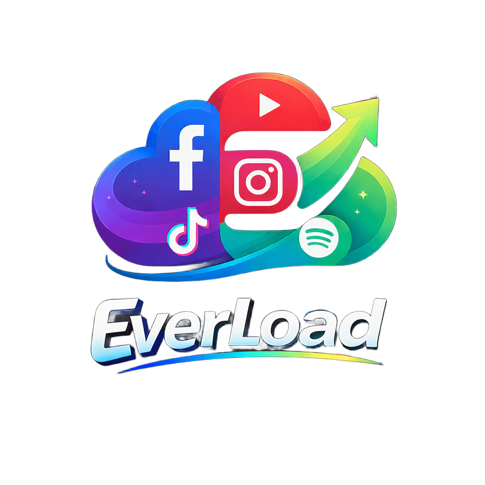
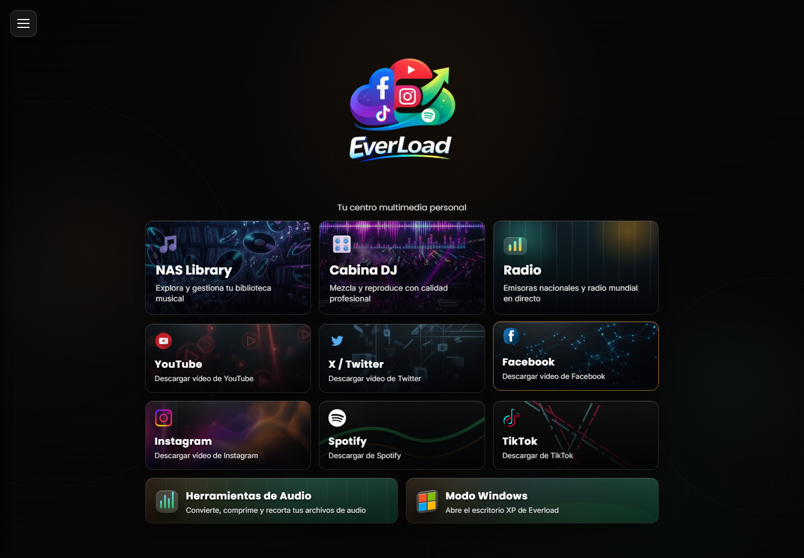
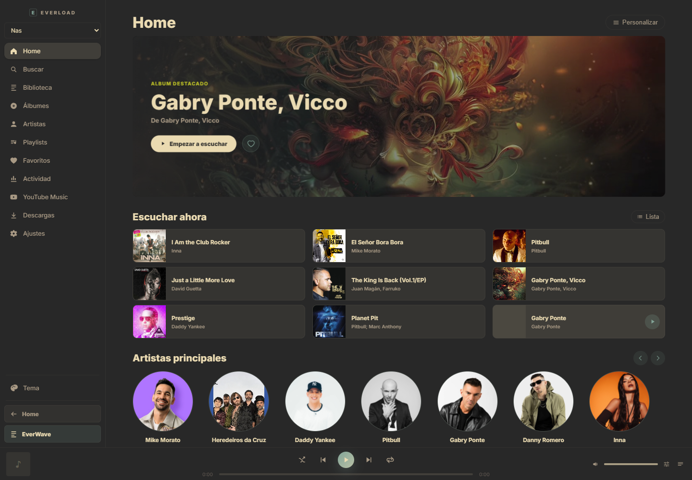
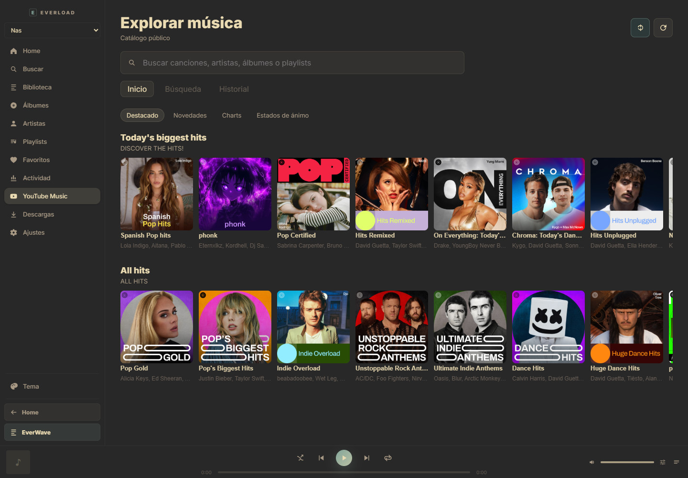
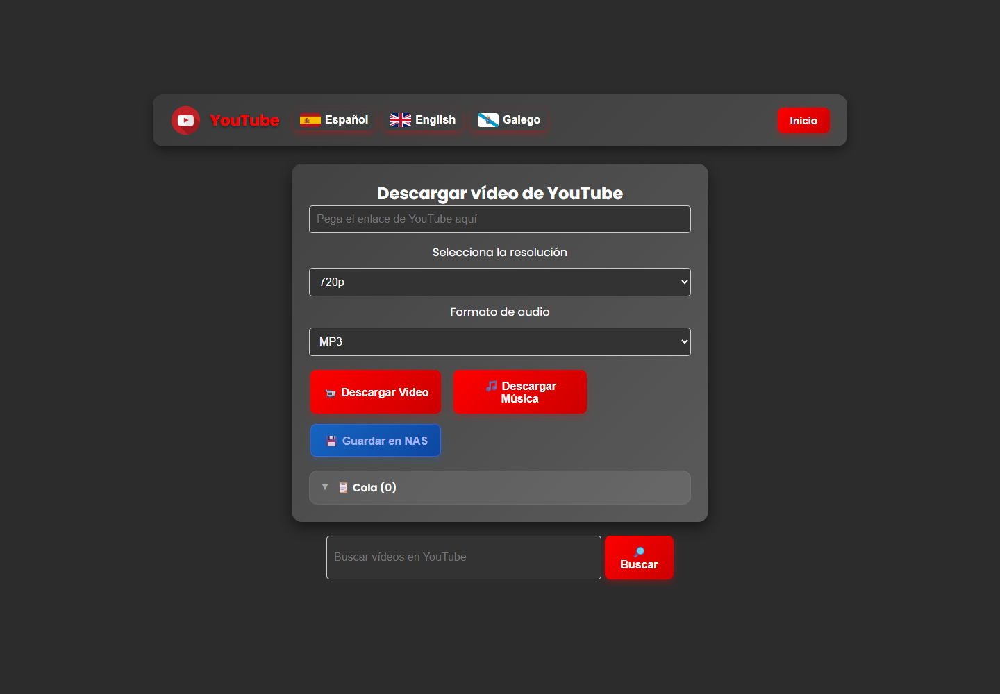
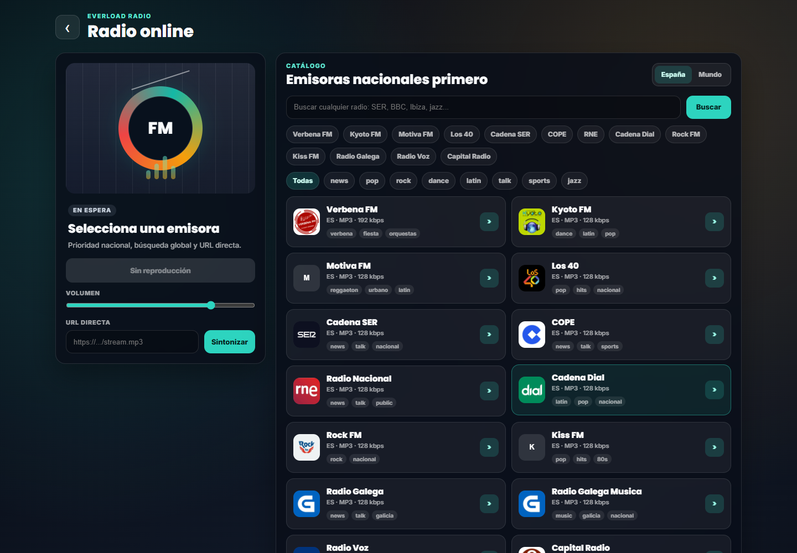
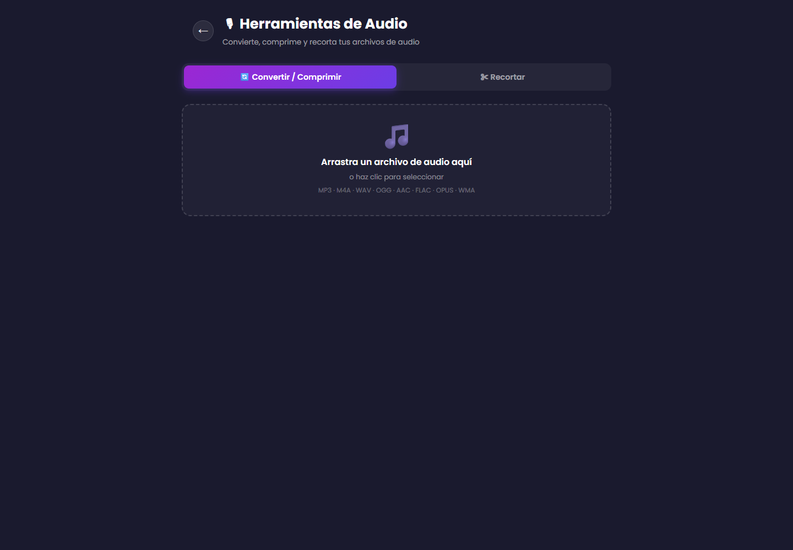
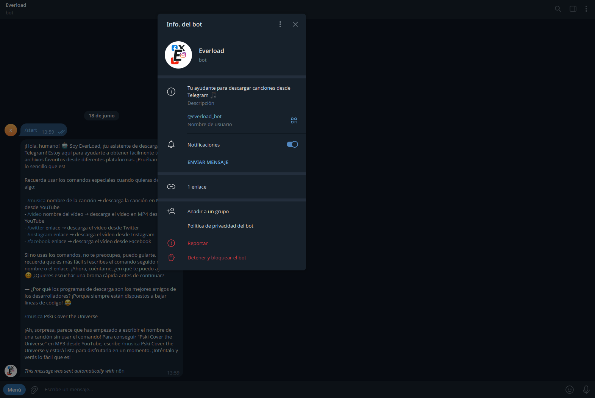
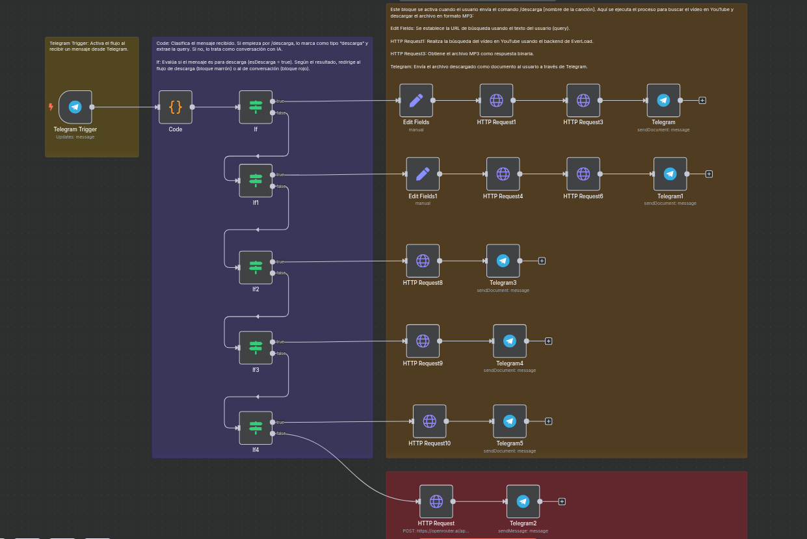
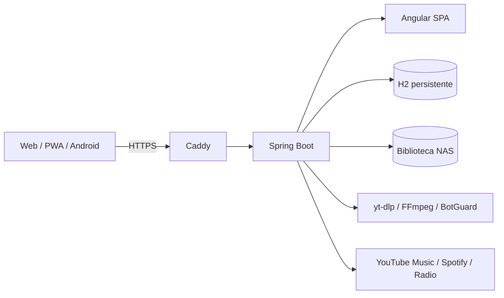

<p align="center">
  
</p>

<h1 align="center">EverLoad</h1>

<p align="center">
  Tu centro multimedia personal, abierto y autoalojado.<br>
  <em>Your open, self-hosted personal media hub.</em>
</p>

<p align="center">
  <a href="https://github.com/xianDT01/Everload/commits/main"></a>
  
  
  
  
  <a href="LICENSE"></a>
</p>

<p align="center">
  <a href="https://everload.duckdns.org"><strong>Instancia en producción</strong></a>
  ·
  <a href="#inicio-rápido"><strong>Inicio rápido</strong></a>
  ·
  <a href="#galería"><strong>Galería</strong></a>
  ·
  <a href="#desarrollo"><strong>Desarrollo</strong></a>
</p>

<p align="center">
  
</p>

## Qué es EverLoad

EverLoad reúne descargas multimedia, música local y NAS, YouTube Music, radio online, herramientas de audio y una cabina DJ en una sola aplicación web. Está diseñada para ejecutarse en tu propia red o servidor, conservar tus archivos bajo tu control y funcionar como PWA en escritorio y móvil.

El proyecto comenzó como un descargador de vídeo y ha crecido hasta convertirse en un ecosistema multimedia completo, con perfiles, permisos, notificaciones, administración, automatizaciones y una aplicación Android complementaria.

> EverLoad is a self-hosted media platform for downloading, organizing, discovering and playing media from a single interface.

## Funciones principales

| Área | Capacidades |
| --- | --- |
| **EverWave** | Reproductor moderno, artistas, álbumes, playlists, favoritos, historial, cola, letras LRC, crossfade, ecualizador y más de 20 temas. |
| **YouTube Music** | Búsqueda, novedades, charts, álbumes, artistas, mixes, radio automática y streaming bajo demanda. |
| **Biblioteca NAS** | Exploración, subida, streaming con rangos HTTP, ZIP, copiar, mover, renombrar, borrar y edición de metadatos ID3. |
| **Descargas** | Vídeo y audio desde YouTube, X/Twitter, Facebook, Instagram, TikTok y playlists de Spotify resueltas mediante YouTube. |
| **Radio online** | Emisoras nacionales e internacionales, búsqueda global, filtros, favoritos y reproducción por URL directa. |
| **Cabina DJ** | Dos decks, mezclador, pitch, crossfader, EQ, filtros, hot cues, VU meters y carga desde NAS o YouTube. |
| **Herramientas de audio** | Conversión, compresión, recorte e inspección de MP3, M4A, WAV, OGG, AAC, FLAC, OPUS y WMA. |
| **Modo Windows** | Escritorio inspirado en Windows XP con explorador NAS, reproductores, bloc de notas, calculadora, juegos y Messenger. |
| **Usuarios y administración** | JWT, roles, aprobación de cuentas, perfiles, avatares, auditoría, backups, mantenimiento, logs y comprobación de APIs. |
| **Experiencia instalada** | PWA, aplicación Android, traducciones ES/EN/GL, avisos offline y notificaciones. |

## Galería

### EverWave y YouTube Music

<table>
  <tr>
    <td width="50%"></td>
    <td width="50%"></td>
  </tr>
  <tr>
    <td align="center"><strong>Biblioteca personal y reproductor moderno</strong></td>
    <td align="center"><strong>Descubrimiento y streaming musical</strong></td>
  </tr>
</table>

### Descargas y radio

<table>
  <tr>
    <td width="50%"></td>
    <td width="50%"></td>
  </tr>
  <tr>
    <td align="center"><strong>Vídeo, audio, búsqueda, cola y guardado en NAS</strong></td>
    <td align="center"><strong>Catálogo nacional, búsqueda mundial y URL directa</strong></td>
  </tr>
</table>

### Herramientas de audio

<p align="center">
  
</p>

## Automatización con Telegram

EverLoad también ha servido como backend para un bot de Telegram orquestado con n8n. La automatización interpreta comandos, solicita contenido a la API y devuelve al usuario los archivos procesados.

<table>
  <tr>
    <td width="50%"></td>
    <td width="50%"></td>
  </tr>
</table>

## Arquitectura


```mermaid
flowchart LR
    Client[Web / PWA / Android] -->|HTTPS| Caddy[Caddy]
    Caddy --> App[Spring Boot]
    App --> UI[Angular SPA]
    App --> DB[(H2 persistente)]
    App --> NAS[(Biblioteca NAS)]
    App --> Media[yt-dlp / FFmpeg / BotGuard]
    App --> External[YouTube Music / Spotify / Radio]
```

| Capa | Tecnología |
| --- | --- |
| Frontend | Angular 17.3, Angular Material/CDK, RxJS, ngx-translate, HLS.js, Web Audio API |
| Backend | Java 17, Spring Boot 3.4.3, Spring Security, Spring Data JPA, WebSocket |
| Multimedia | yt-dlp, FFmpeg, Chromaprint, jaudiotagger y RustyPipe BotGuard |
| Persistencia | H2 en volumen persistente, biblioteca NAS y backups en el host |
| Operación | Docker Compose, Caddy, HTTPS automático y health checks |
| API | REST, OpenAPI y Swagger UI |

## Inicio rápido

### Requisitos

- Docker Desktop o Docker Engine con Compose.
- Puertos `80` y `443` libres.
- Una carpeta del host para música y otra para backups.

### 1. Preparar el entorno

```bash
git clone https://github.com/xianDT01/Everload.git
cd Everload
cp .env.example .env
```

En PowerShell:

```powershell
Copy-Item .env.example .env
```

Edita `.env` y define, como mínimo, un secreto JWT aleatorio:

```env
JWT_SECRET=una_clave_aleatoria_de_32_caracteres_o_mas
CADDY_DOMAIN=localhost
CADDY_EMAIL=admin@example.com
```

También debes adaptar en `docker-compose.yml` las dos rutas del host montadas como biblioteca NAS y directorio de backups.

### 2. Construir y arrancar

```bash
docker compose up -d --build
```

Comprueba el estado:

```bash
docker compose ps
docker compose logs --tail=100 everload
```

La aplicación estará disponible en `https://localhost`. Caddy utilizará un certificado local, por lo que el navegador puede mostrar un aviso la primera vez.

### Producción

Configura un dominio real en `.env` y apunta sus registros DNS al servidor:

```env
CADDY_DOMAIN=everload.example.com
CADDY_EMAIL=you@example.com
CORS_ALLOWED_ORIGINS=https://everload.example.com
```

Caddy solicitará y renovará automáticamente el certificado TLS cuando los puertos `80` y `443` sean accesibles desde Internet.

## Configuración

| Variable | Descripción |
| --- | --- |
| `JWT_SECRET` | Obligatoria. Secreto para firmar tokens JWT; usa al menos 32 caracteres aleatorios. |
| `CADDY_DOMAIN` | Dominio público o `localhost` para desarrollo. |
| `CADDY_EMAIL` | Correo utilizado para certificados TLS. |
| `CORS_ALLOWED_ORIGINS` | Lista separada por comas de orígenes permitidos. |
| `APP_CONFIG_PATH` | Configuración persistente de integraciones y APIs. |
| `APP_BACKUP_PATH` | Directorio persistente de backups. |
| `APP_MAINTENANCE_FLAG` | Archivo que controla el modo mantenimiento. |

Consulta [`.env.example`](.env.example) y [`docker-compose.yml`](docker-compose.yml) para ver la configuración completa.

## Desarrollo

### Backend

```bash
./mvnw spring-boot:run
```

En Windows:

```powershell
.\mvnw.cmd spring-boot:run
```

El backend y Swagger quedan disponibles en:

- Aplicación/API: `http://localhost:8080`
- Swagger UI: `http://localhost:8080/swagger-ui.html`

### Frontend

```bash
cd everload-front
npm ci
npm start -- --host 127.0.0.1 --port 4200
```

Angular estará disponible en `http://localhost:4200` y redirigirá las llamadas API al backend de desarrollo.

### Pruebas

```bash
./mvnw test
```

```bash
cd everload-front
npm test -- --watch=false --browsers=ChromeHeadless
```

## API principal

| Recurso | Base path |
| --- | --- |
| Autenticación | `/api/auth` |
| Descargas | `/api/downloadVideo`, `/api/downloadMusic` y proveedores específicos |
| YouTube y YouTube Music | `/api/youtube`, `/api/ytmusic` |
| Spotify | `/api/spotify` |
| NAS y streaming | `/api/nas`, `/api/music` |
| Biblioteca personal | `/api/library` |
| Audio | `/api/audio` |
| Chat y presencia | `/api/chat`, `/api/presence` |
| Notificaciones | `/api/notifications` |
| Administración | `/api/admin/*` |

## Estructura del repositorio

```text
Everload/
├── everload-front/                 Angular SPA
├── src/main/java/com/EverLoad/     Backend Spring Boot
├── src/main/resources/             Configuración y frontend compilado
├── docs/assets/                    Capturas y recursos del README
├── Dockerfile                      Build multi-stage de producción
├── docker-compose.yml              Aplicación y proxy HTTPS
├── Caddyfile                       Reverse proxy y TLS
└── pom.xml                         Build Maven
```

## Idiomas

La interfaz incluye traducciones para:

- Español (`es`)
- English (`en`)
- Galego (`gl`)

Los catálogos se encuentran en `everload-front/src/assets/i18n`.

## Seguridad y datos

- No publiques el archivo `.env` ni claves de APIs.
- EverLoad no incluye credenciales de administrador predeterminadas.
- Limita las rutas NAS montadas a los directorios que realmente necesite la aplicación.
- Haz copias periódicas del volumen de base de datos, avatares, configuración y certificados de Caddy.
- Para una instalación expuesta a Internet, mantén Docker, Java, yt-dlp y las imágenes base actualizadas.

## Limitaciones conocidas

- Las descargas dependen de la disponibilidad pública del contenido y de la compatibilidad de yt-dlp con cada plataforma.
- Spotify se utiliza para resolver metadatos y pistas mediante YouTube; no se descarga audio directamente desde Spotify.
- Algunas emisoras bloquean reproducción web, cambian sus URLs o aplican restricciones geográficas.
- YouTube Music, búsqueda de carátulas, radio y automatizaciones externas requieren conexión a Internet.
- H2 es práctico para self-hosting personal, pero requiere una estrategia de backups fiable.

## Licencia

Distribuido bajo la [licencia MIT](LICENSE).

Creado y mantenido por **Xián Duán Taboada**.
