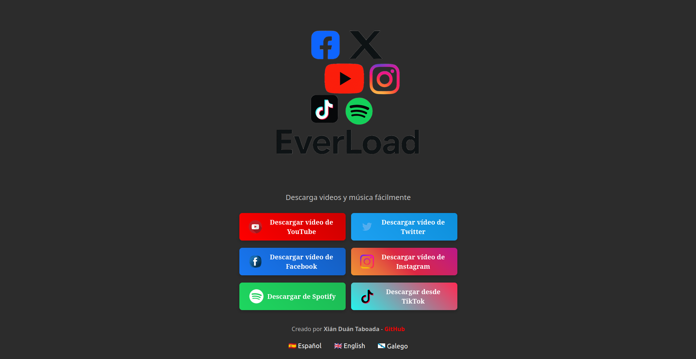
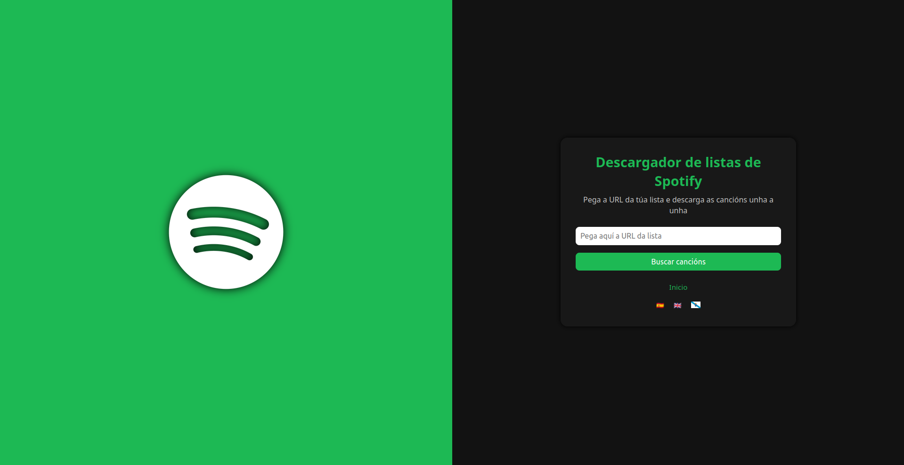
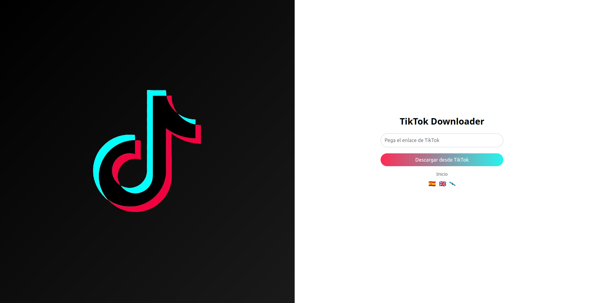

# EverLoad

**EverLoad** es una aplicación desarrollada en **Spring Boot** y **Angular 16** que permite descargar vídeos y audios desde las plataformas más populares, gestionar una biblioteca musical en red (NAS), comunicarse mediante chat en tiempo real y administrar el sistema completo desde un panel de control, todo desde tu red privada.

**EverLoad** is an app built with **Spring Boot** and **Angular 16** for downloading videos and audio from the most popular platforms, managing a NAS music library, real-time chat, and full system administration — all within your private network.

**EverLoad** é unha aplicación feita con **Spring Boot** e **Angular 16** para descargar vídeos e audios das plataformas máis populares, xestionar unha biblioteca musical en rede (NAS), comunicarse por chat en tempo real e administrar o sistema completo desde un panel de control, todo desde a túa rede privada.

---

## Vista previa

<p align="center">
  
</p>

<p align="center">
  
  
  
  
  
  
</p>

---

## Características

### Autenticación y usuarios

- Registro con email, contraseña y nombre de usuario.
- Login con JWT. El token se renueva sin necesidad de volver a hacer login.
- Sistema de aprobación: los nuevos registros quedan en estado **PENDING** hasta que un administrador los activa.
- Tres roles de usuario:
  - **ADMIN** — acceso total: panel de administración, NAS, descargas, chat.
  - **NAS_USER** — acceso a la biblioteca NAS y descargas.
  - **BASIC_USER** — descargas y chat.
- Avatares de perfil (JPEG, PNG, WebP, GIF; máx. 5 MB).
- Ajuste de privacidad: ocultar/mostrar "último visto".
- Cambio de contraseña desde el perfil.
- Indicador de presencia (online/offline) en tiempo real.
- Cierre de sesión con revocación del token en el servidor.

---

### Descargas de contenido

Plataformas soportadas:

| Plataforma | Vídeo | Audio/MP3 | Playlists |
|---|---|---|---|
| YouTube | ✅ (resolución configurable) | ✅ | ✅ |
| Twitter/X | ✅ | — | — |
| Facebook | ✅ | — | — |
| Instagram | ✅ (Reels y posts públicos) | — | — |
| TikTok | ✅ | — | — |
| Spotify | — | ✅ (busca en YouTube) | ✅ |

Características adicionales:

- Cola de descargas con estado en tiempo real (pendiente / descargando / completado / fallido).
- Descarga directa al navegador o guardado en el almacenamiento NAS.
- Vista previa del vídeo integrada antes de descargar.
- Búsqueda de vídeos de YouTube desde la propia interfaz.
- Compartir vídeos de YouTube directamente en grupos de chat.
- Historial de descargas con título, plataforma, tipo y fecha.
- Notificación automática al completarse o fallar una descarga.

---

### NAS Music — Biblioteca musical en red

Gestión de archivos:

- Navegar la estructura de carpetas de las rutas NAS configuradas.
- Subir archivos de música (con preservación de estructura de carpetas).
- Descargar archivos individuales o carpetas completas en ZIP.
- Crear, eliminar, renombrar y mover archivos y carpetas.
- Establecer portada personalizada por carpeta.
- Copiar archivos entre distintas rutas NAS.

Reproducción y metadatos:

- Streaming de audio con soporte de rango HTTP (permite mover el seek sin recargar).
- Extracción de metadatos ID3: título, artista, álbum, año, carátula embebida.
- Edición de etiquetas ID3 directamente desde el navegador.
- Búsqueda recursiva por nombre de archivo, título, artista y álbum.
- Paginación de resultados (50 elementos por página).
- Reproducción aleatoria (shuffle) sin repetición: recorre toda la biblioteca antes de repetir.
- Botón "anterior" que navega al track realmente anterior, no al inicio.
- Carpetas favoritas en la barra lateral, editables y eliminables.
- Carátulas de carpeta (primera pista o imagen personalizada).
- Reproducción aleatoria de pista desde la pantalla de inicio.

---

### Modo DJ — Decks profesionales

Dos decks independientes (A y B) con:

- Carga de pistas desde la biblioteca NAS o búsqueda en YouTube.
- Vinilo animado con portada de álbum (local o via iTunes API si no hay carátula embebida).
- Control de velocidad: pitch slider (±6%) con doble clic para reset.
- Espectro de audio en tiempo real (Web Audio API).

Mezclador central:

- Crossfader con curva equal-power.
- Faders de canal independientes con VU meters.
- Ecualizador de 3 bandas (HI / MID / LOW) por canal.
- Filtro de barrido LP→HP por canal.

Funciones de carga inteligente:

- Doble clic en cualquier pista para cargarla al deck inactivo automáticamente.
- Historial de pistas reproducidas.
- Navegación por carpetas NAS, biblioteca y resultados de YouTube.
- Carátulas automáticas via iTunes API cuando el archivo no tiene portada.
- Modal de ayuda (`?`) con explicación de todos los controles.

---

### Chat en tiempo real

Tipos de conversación:

- **Chat privado** (1 a 1).
- **Grupo** (miembros ilimitados).
- **Canal de anuncios** (solo el administrador del canal puede publicar).

Mensajes:

- Texto con autocompletado de menciones (`@usuario`).
- Compartir vídeos de YouTube con tarjeta (título, miniatura, canal).
- Selector de emojis (50+).
- Responder a mensajes específicos (cita anidada).
- Copiar mensaje al portapapeles.
- Búsqueda de mensajes dentro del grupo.
- Acuse de recibo en chats privados (✓ enviado / ✓✓ leído).
- Separadores de fecha y agrupación de mensajes por remitente.

Gestión de grupos:

- Crear grupos con nombre, descripción y avatar.
- Añadir y expulsar miembros.
- Roles de miembro: ADMIN, MODERATOR, MEMBER.
- Silenciar grupo (1h, 8h, 24h o indefinidamente).
- Abandonar o eliminar grupo.
- Borrar todo el historial de mensajes.
- Indicador de miembros online dentro del grupo.
- "Buzz" — notificación de llamada de atención al otro usuario.

Temas visuales del chat: EverLoad, WhatsApp, Telegram, Discord.

---

### Notificaciones

- Centro de notificaciones con contador de no leídas (campana).
- Lista de las últimas 20 notificaciones.
- Tipos: descarga completada ✅, descarga fallida ❌, mensaje de chat 💬, invitación a grupo 👥, aviso de administrador 📢.
- Marcar como leída individualmente o todas a la vez.
- Los avisos de tipo `admin_notice` se muestran automáticamente como toast emergente sin necesidad de abrir el panel.
- Toast con barra de progreso y cuenta atrás.

---

### Perfil de usuario

- Ver y editar nombre de usuario y email.
- Subir o eliminar avatar.
- Cambiar contraseña (requiere contraseña actual).
- Configurar privacidad: mostrar u ocultar "último visto".
- Badge de rol visible (Admin / NAS User / Basic User).

---

### Panel de administración

Accesible únicamente para usuarios con rol ADMIN. Dividido en pestañas:

#### Configuración
- Gestionar claves de API: YouTube, Spotify (Client ID y Secret), AcoustID, GitHub Token (para actualizaciones desde repositorios privados).
- Token de GitHub con opción mostrar/ocultar y paso a paso de instrucciones.

#### Usuarios
- Lista de usuarios pendientes de aprobación con botones de aprobar (asignar rol) o rechazar.
- Lista de usuarios activos con estado online, último visto, rol y fecha de registro.
- Cambiar rol de cualquier usuario (con actualización inmediata en la sesión si es el propio usuario).
- Revocar acceso o eliminar usuario.

#### Rutas NAS
- Listar, añadir y eliminar rutas NAS configuradas (nombre, ruta física, descripción).

#### Logs
- Ver las últimas líneas del log de la aplicación en tiempo real.
- Filtrar por texto.
- Limpiar el archivo de log.

#### Historial de descargas
- Ver todas las descargas del sistema (título, tipo, plataforma, fecha).
- Vaciar el historial.

#### Chat (moderación)
- Listar todos los grupos con número de mensajes, miembros y último mensaje.
- Buscar grupos.
- Ver mensajes y miembros de cualquier grupo.
- Eliminar mensajes individuales o grupos completos.
- Expulsar miembros de cualquier grupo.

#### Audit Log
- Registro paginado de todas las acciones sensibles del sistema (acción, actor, entidad, fecha, detalles).
- Búsqueda por acción, actor o entidad.
- Filtro por tipo de evento.
- Limpiar el log de auditoría.

#### Sistema
- **Modo mantenimiento**: activar/desactivar con mensaje personalizado. Los usuarios no admin ven una pantalla de bloqueo. Las solicitudes a `/api/**` devuelven 503.
- **Aviso previo al mantenimiento**: envía una notificación toast a todos los usuarios activos con una cuenta atrás configurable (por defecto 60 s) antes de activar el mantenimiento.
- **Backups**: crear, listar, restaurar y eliminar copias de seguridad de la base de datos. Política de retención configurable.
- **Información del sistema**: versión de la app (commit de git), versión de Java, tiempo de actividad, tamaño y ruta de la base de datos.
- **Comprobación de actualizaciones**: consulta el repositorio de GitHub, compara versión actual con la última, muestra notas de la release y enlace. Funciona con repositorios privados si se configura el token.
- **Estado de APIs externas**: test de conectividad de YouTube, Spotify, TikTok, Facebook e Instagram.

---

### Internacionalización

Tres idiomas disponibles con cambio dinámico sin recarga:

- Español (es)
- Galego (gl)
- English (en)

El idioma seleccionado se guarda en `localStorage`.

---

## Requisitos

- Java 21+
- Node.js 20+ y Angular CLI
- [`yt-dlp`](https://github.com/yt-dlp/yt-dlp)
- FFmpeg
- Docker + Docker Compose (para despliegue con HTTPS)

---

## Ejecución en desarrollo

### Backend

```bash
mvn clean package
java -jar target/everload-1.0.0.jar
```

Backend disponible en `http://localhost:8080`.

### Frontend

```bash
cd everload-front
npm install
ng serve
```

Frontend disponible en `http://localhost:4200`.

---

## Despliegue con Docker

EverLoad incluye un stack Docker con **Caddy** como reverse proxy con HTTPS automático.

### Levantar la aplicación

```bash
# Primera vez o tras cambios en el código
docker compose up --build -d

# Sin reconstruir
docker compose up -d

# Solo el contenedor de la app (sin Caddy)
docker compose up --build -d everload
```

La aplicación queda disponible en:

- `https://localhost` (certificado auto-firmado de Caddy CA)
- `http://localhost` → redirige automáticamente a HTTPS

### Variables de entorno

| Variable | Por defecto | Descripción |
|---|---|---|
| `JWT_SECRET` | (dev key) | **Cambiar en producción.** |
| `CADDY_DOMAIN` | `localhost` | Dominio. Usa tu dominio real para Let's Encrypt. |
| `CADDY_EMAIL` | `admin@example.com` | Email para Let's Encrypt. |
| `CORS_ALLOWED_ORIGINS` | `http://localhost:4200,...` | Orígenes CORS permitidos. |
| `APP_BACKUP_PATH` | `/app/backups` | Directorio de backups. |
| `APP_MAINTENANCE_FLAG` | `/app/data/maintenance.flag` | Fichero de flag de mantenimiento. |
| `APP_CONFIG_PATH` | `/app/data/config.json` | Fichero de configuración persistente. |

### Volúmenes persistentes

| Volumen | Descripción |
|---|---|
| `everload-db` | Base de datos H2 |
| `everload-avatars` | Avatares de usuario |
| `caddy-data` | Certificados TLS — **hacer backup en producción** |
| `caddy-config` | Caché de configuración de Caddy |

### Montar tu biblioteca de música (NAS)

**Windows:**

```yaml
# En docker-compose.yml, sección volumes del servicio everload:
- C:/Users/TuUsuario/Music:/app/nas_storage:ro
```

> En Docker Desktop → Settings → Resources → File Sharing, añade la ruta antes de reiniciar.

**Linux/Mac:**

```yaml
- /ruta/a/tu/musica:/app/nas_storage:ro
```

Después configura esa ruta desde el panel de administración → pestaña NAS.

---

## API REST — Resumen de endpoints

### Autenticación
| Método | Ruta | Descripción |
|---|---|---|
| POST | `/api/auth/register` | Registro |
| POST | `/api/auth/login` | Login (devuelve JWT) |
| POST | `/api/auth/refresh` | Renovar token |
| POST | `/api/auth/logout` | Cerrar sesión |

### Descargas
| Método | Ruta | Descripción |
|---|---|---|
| GET | `/api/downloadVideo` | Vídeo de YouTube |
| GET | `/api/downloadMusic` | Audio MP3 de YouTube |
| GET | `/api/downloadTwitter` | Vídeo de Twitter/X |
| GET | `/api/downloadFacebook` | Vídeo de Facebook |
| GET | `/api/downloadInstagram` | Vídeo de Instagram |
| GET | `/api/downloadTikTok` | Vídeo de TikTok |
| GET | `/api/playlistVideos` | Listar vídeos de playlist YT |
| POST | `/api/saveMusicToNas` | Guardar audio de YT en NAS |

### NAS
| Método | Ruta | Descripción |
|---|---|---|
| GET | `/api/nas/paths` | Listar rutas NAS |
| POST | `/api/nas/paths` | Añadir ruta NAS |
| DELETE | `/api/nas/paths/{id}` | Eliminar ruta NAS |
| GET | `/api/nas/browse/{pathId}` | Listar contenido de ruta |
| POST | `/api/nas/browse/{pathId}/mkdir` | Crear carpeta |
| DELETE | `/api/nas/browse/{pathId}/delete` | Eliminar archivo/carpeta |
| PUT | `/api/nas/browse/{pathId}/rename` | Renombrar |
| PUT | `/api/nas/browse/{pathId}/move` | Mover |
| POST | `/api/nas/browse/{pathId}/cover` | Establecer portada de carpeta |
| POST | `/api/nas/browse/{pathId}/upload` | Subir archivos |
| GET | `/api/nas/browse/{pathId}/download` | Descargar archivo |
| GET | `/api/nas/browse/{pathId}/download-zip` | Descargar carpeta como ZIP |
| POST | `/api/nas/copy` | Copiar archivo entre rutas |

### Música
| Método | Ruta | Descripción |
|---|---|---|
| GET | `/api/music/random` | Pistas aleatorias para el inicio |
| GET | `/api/music/search` | Buscar pistas |
| GET | `/api/music/metadata` | Metadatos paginados |
| PUT | `/api/music/metadata` | Actualizar tags ID3 |
| GET | `/api/music/stream` | Streaming de audio |
| GET | `/api/music/cover` | Carátula embebida |
| GET | `/api/music/folder-cover` | Carátula de carpeta |
| POST | `/api/music/youtube/prepare` | Cachear audio de YouTube para DJ |
| GET | `/api/music/youtube/stream` | Streaming de audio YouTube |

### Chat
| Método | Ruta | Descripción |
|---|---|---|
| GET | `/api/chat/groups` | Grupos del usuario |
| POST | `/api/chat/groups` | Crear grupo |
| GET | `/api/chat/groups/{id}/messages` | Mensajes del grupo |
| POST | `/api/chat/groups/{id}/messages` | Enviar mensaje |
| GET | `/api/chat/groups/{id}/messages/search` | Buscar mensajes |
| POST | `/api/chat/private/{username}` | Chat privado |
| PUT | `/api/chat/groups/{id}/info` | Actualizar info del grupo |
| POST | `/api/chat/groups/{id}/avatar` | Avatar del grupo |
| POST | `/api/chat/groups/{id}/members` | Añadir miembro |
| DELETE | `/api/chat/groups/{id}/members/{username}` | Expulsar miembro |
| PUT | `/api/chat/groups/{id}/members/{username}/role` | Cambiar rol de miembro |
| POST | `/api/chat/groups/{id}/leave` | Abandonar grupo |
| DELETE | `/api/chat/groups/{id}` | Eliminar grupo |
| GET | `/api/chat/users` | Lista de usuarios activos |

### Notificaciones
| Método | Ruta | Descripción |
|---|---|---|
| GET | `/api/notifications` | Notificaciones del usuario |
| GET | `/api/notifications/unread-count` | Contador de no leídas |
| POST | `/api/notifications/mark-all-read` | Marcar todas como leídas |
| POST | `/api/notifications/{id}/read` | Marcar una como leída |

### Administración
| Método | Ruta | Descripción |
|---|---|---|
| GET/POST | `/api/admin/config` | Configuración de la app |
| GET | `/api/admin/users/pending` | Usuarios pendientes |
| GET | `/api/admin/users/active` | Usuarios activos |
| PUT | `/api/admin/users/{id}` | Cambiar rol/estado |
| POST | `/api/admin/users/{id}/revoke` | Revocar acceso |
| DELETE | `/api/admin/users/{id}` | Eliminar usuario |
| GET/POST | `/api/admin/maintenance` | Modo mantenimiento |
| POST | `/api/admin/system/warn-maintenance` | Aviso previo mantenimiento |
| GET | `/api/admin/system/info` | Info del sistema |
| GET | `/api/admin/system/check-update` | Comprobar actualización |
| POST | `/api/admin/system/prepare-update` | Preparar actualización |
| GET | `/api/admin/backup/list` | Listar backups |
| POST | `/api/admin/backup/create` | Crear backup |
| POST | `/api/admin/backup/restore/{name}` | Restaurar backup |
| DELETE | `/api/admin/backup/{name}` | Eliminar backup |
| GET | `/api/admin/logs` | Ver logs |
| POST | `/api/admin/logs/clear` | Limpiar logs |
| GET | `/api/admin/audit` | Log de auditoría |
| DELETE | `/api/admin/audit/clear` | Limpiar auditoría |
| GET | `/api/admin/history` | Historial de descargas |
| DELETE | `/api/admin/history/clear` | Limpiar historial |
| GET | `/api/admin/test-api/{platform}` | Test de API externa |

---

## Swagger

Documentación interactiva de la API disponible en:

```
http://localhost:8080/swagger-ui.html
```

---

## Limitaciones conocidas

- Instagram, Facebook y Twitter/X: solo contenido público.
- Spotify: no descarga desde Spotify directamente, busca los títulos en YouTube.
- La carátula automática via iTunes API requiere conexión a Internet desde el navegador.
- El modo DJ con YouTube requiere conexión a Internet para la carga de vídeos.
- El JWT no se invalida al cambiar el rol hasta que expira; el cambio de rol en la BD se aplica en la siguiente sesión (el frontend se actualiza inmediatamente).

---

## Autor

**Xián Duán Taboada**  
GitHub: https://github.com/xianDT01

---

## Licencia

Proyecto bajo licencia MIT.  
Puedes usarlo, modificarlo y distribuirlo con atribución:  
**Xián Duán Taboada — xiandt01@gmail.com**

Consulta [LICENSE](./LICENSE) para más detalles.
